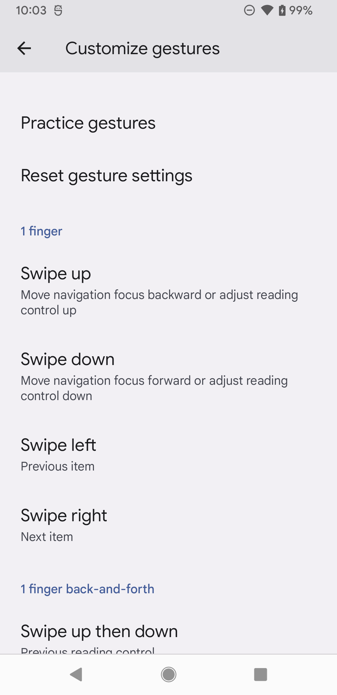
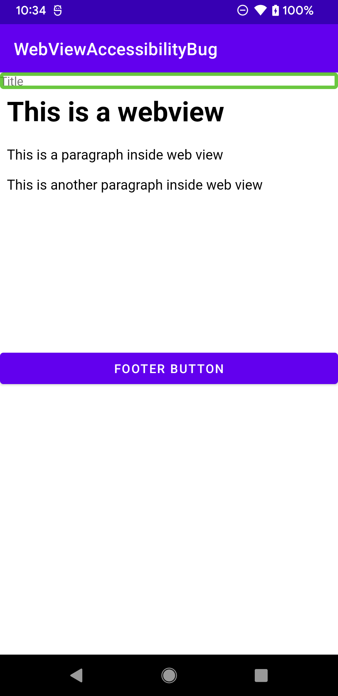
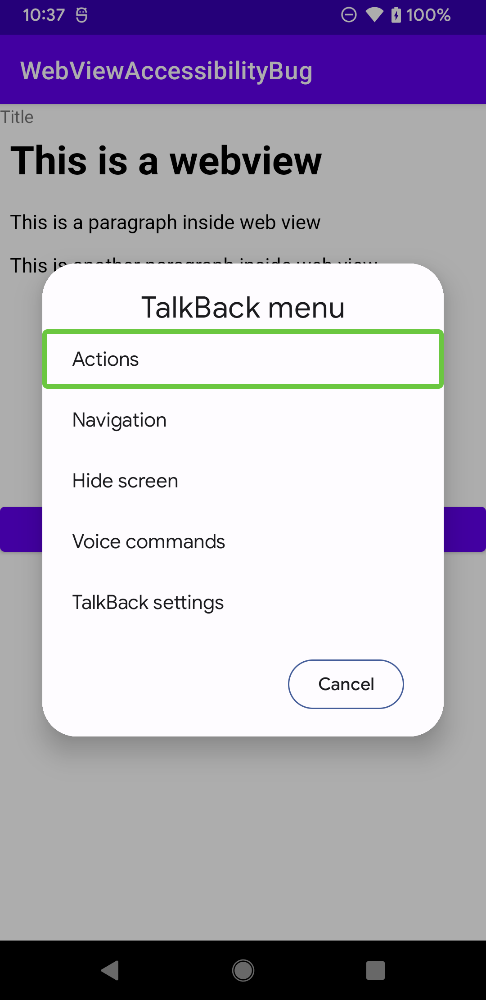
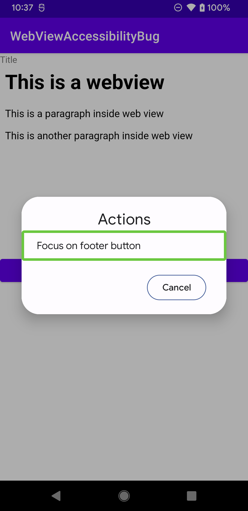
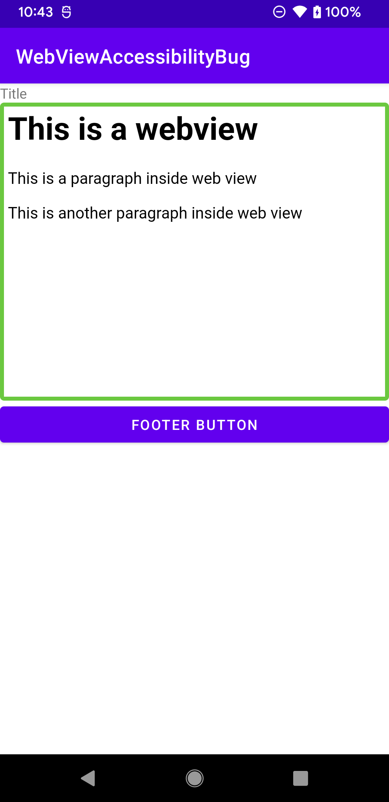
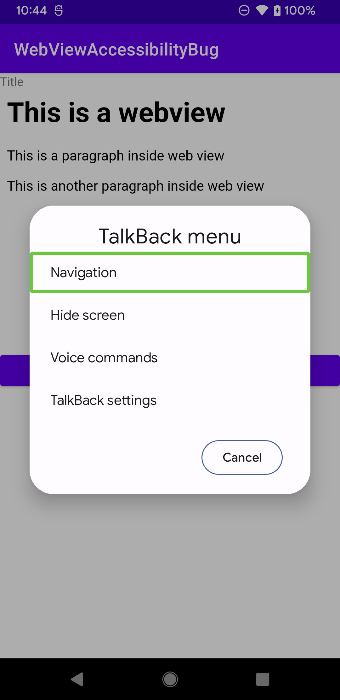
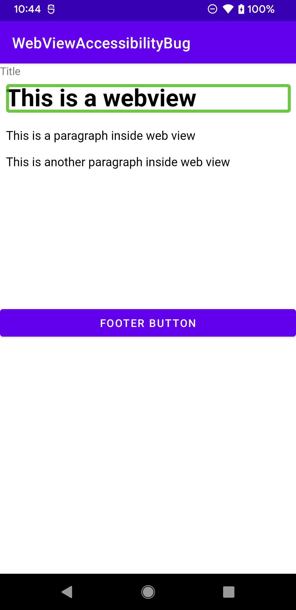

## Web View Accessibility Investigation
This project demonstrates an accessibility bug when adding custom accessibility actions to web view.
It uses a custom delegate to add an accessibility action to a text view and a web view.  The
action is successfully added to the text view but the web view does not respect the added action.

## Steps to reproduce
All talk back gestures are set to default

Open up the project and turn on talk back.  The initial focus will be on `Title` text view, which has the custom delegate set on it.

`Swipe up then right` to open up the talk back context menu.  `Actions` will be present in the context menu as specified in the delegate.  Double tap to activate action to confirm that the custom action is present.

    

Move the accessibility focus to web view by `right swiping` and bring up the context menu.  
**BUG**: Notice that the web view does not have an actions item in context menu even though the custom accessibility delegate was set on it.

 

Move the focus inside the web view by `right swiping` and bring up the context menu.  Notice that there is no custom actions present even thoug the custom delegate was set on the web view

 
